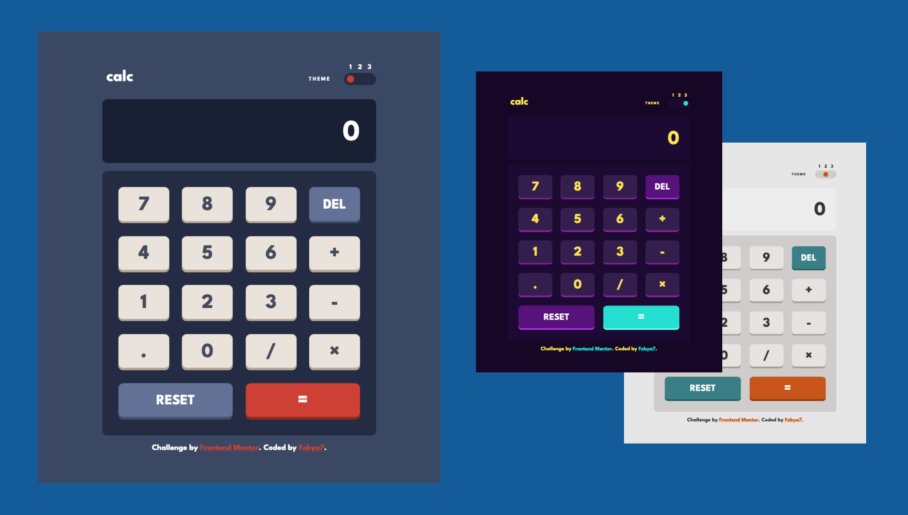
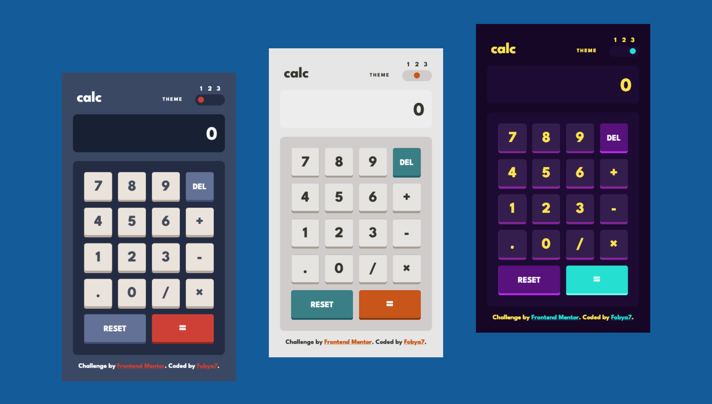
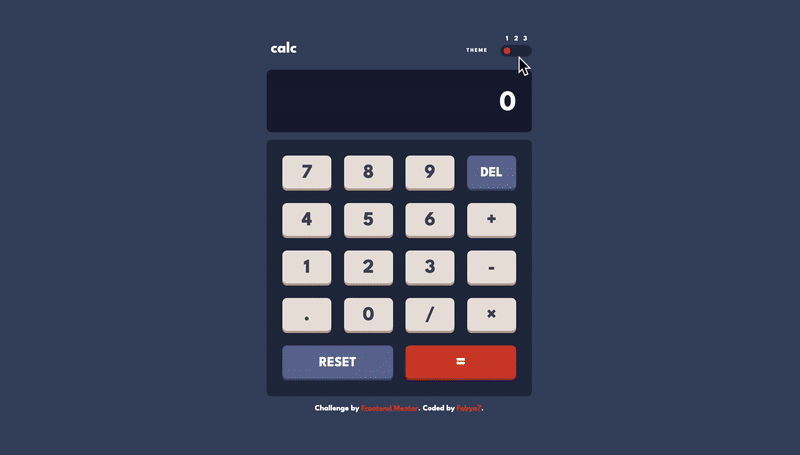
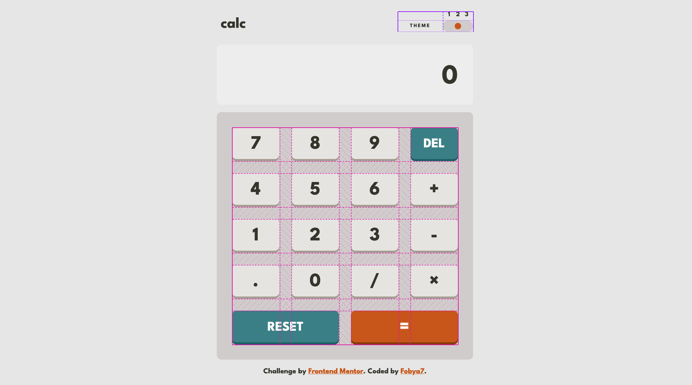
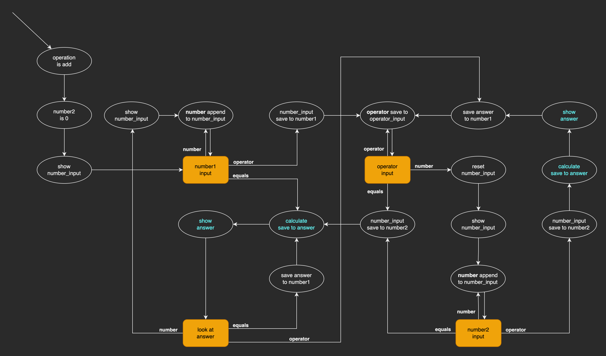

# Calculator App With Animated Theme Switching

This is a solution to the [Calculator app challenge on Frontend Mentor](https://www.frontendmentor.io/challenges/calculator-app-9lteq5N29) with a little bit of my flare.


## Table of contents

- [Overview](#overview)
  - [The challenge](#the-challenge)
  - [Solution](#solution)
- [My process](#my-process)
  - [Built with](#built-with)
  - [What I learned](#what-i-learned)
  - [Continued development](#continued-development)

## Overview

### The challenge

Users should be able to:

- See the size of the elements adjust based on their device's screen size
- Perform mathmatical operations like addition, subtraction, multiplication, and division
- Adjust the color theme based on their preference
- **Bonus**: Have their initial theme preference checked using `prefers-color-scheme` and have any additional changes saved in the browser

### Solution

Live website: [here](https://fobya7.github.io/calc/)!

| Desktop |
| :---: |
|  |

| Mobile |
| :---: |
|  |

Preview of theme switching:


Preview of button presses:


## My process

### Built with

- Semantic HTML5 markup featuring CSS Grid,
- Sass interpolation, flow control and mixins,
- Angular with use of NGX Cookie Service

### What I learned

- This was the first time I've used [CSS grid](https://developer.mozilla.org/en-US/docs/Web/CSS/CSS_Grid_Layout). In most cases, a layout based on horizontal / vertical flexboxes makes more sense - that's my excuse for branching out so late. But here there were two(!) cases, where the grid made more sense.
    
    First one is obvious - the calculator keys. Second one less so - the theme switch.

    

---

- I've also did some documentation! Tho, I'm admitting, not all code is covered. I had a blast with [sassdoc](http://sassdoc.com/getting-started/).

---

- I now have a way better understanding of Sass. Be it mixins or interpolation.

    It all started when I got tired of media calls and went looking for a better solution. I got inspired by this [blogpost](https://itnext.io/writing-media-queries-with-sass-mixins-3ea591ea3ea4) to turn all of my:

    ```css
    button
    {
        border-radius: 0.5rem;
        border: none;
    }
    @media only screen and (max-width: (layout.$breakpoint-desktop - 1))
    {
        button { width: 10rem; }
    }
    @media only screen and (min-width: layout.$breakpoint-desktop)
    {
        button { width: 15rem; }
    }
    ```

    Into:
    ``` scss
    button
    {
        border-radius: 0.5rem;
        border: none;
        @include b.mobile  { width: 10rem; }
        @include b.desktop { width: 15rem; }
    }
    ```

    (Which just looks way better.)
    
    Thanks to those:
    ``` scss
    $breakpoint-desktop: 1000px;
    @mixin mobile {
        @media only screen and (max-width: ($breakpoint-desktop - 1))
            { @content; }
        }
    @mixin desktop {
        @media only screen and (min-width: $breakpoint-desktop)
            { @content; }
        }
    ```

---

- Theming was a little bit more difficult. I had this [medium article](https://medium.com/@dmitriy.borodiy/easy-color-theming-with-scss-bc38fd5734d1) as my starting point.

    At first I figured out, how to make color switch with theme, by using a scope with variables.

    ``` css
    @mixin themed
    {
        .default, .default &
        {
            $background-color: blue !global;
            @content;
        }
        .light, .light &
        {
            $background-color: white !global;
            @content;
        }
        .dark, .dark &
        {
            $background-color: black !global;
            @content;
        }
    }
    ```

---

- But just switching colors wasn't enough. The sudden jump between themes felt jarring to me. So I embarked on a journey of figuring out, how to animate the transition between colors. I knew [the basics of css animation](https://www.w3schools.com/css/css3_animations.asp), about [sass maps](https://sass-lang.com/documentation/values/maps) and had a deeper look at [mixins](https://sass-lang.com/documentation/at-rules/mixin).

    I build my own solution for dynamic color switching with use of css animation. And then refined it thanks to this (kinda unrelated) [stack overflow answer](https://stackoverflow.com/a/3012987/12731017).

    This is its beating heart. (Tho I doubt it's readablity to anyone by me; countless revisions destilled it into a flattened, interpolation ridden form.)

    ```scss
    @mixin dynamic-colors( $background-color-name, $color-name ) {
    @each $theme-name, $theme in $themes
    {
        @keyframes anim-color-#{$theme-name}
        {
            from {
                background-color: var(--background-color-prev);
                color: var(--color-prev);
                }
            to {
                background-color: var(--background-color);
                color: var(--color);
                }
        }
        .#{$theme-name} &
        {
            background-color: var( --background-color );
            color: var( --color );

            animation-name: anim-color-#{$theme-name};
            animation-duration: 1s;
        }

        @each $prev-theme-name, $prev-theme in $themes {
        .prev-#{$prev-theme-name}.#{$theme-name} &
        {
            --background-color-prev: #{map.get( $prev-theme, $background-color-name )};
            --color-prev: #{map.get( $prev-theme, $color-name )};
            --background-color: #{map.get( $theme, $background-color-name )};
            --color: #{map.get( $theme, $color-name )};
        } }
    } }
    ```

    Here's where all the themes live: (Each of the variables reffers to a map; full maps omitted for brevity.)
    ```scss

    $dark:
    (
        "background": hsl(268, 75%, 9%),
            "on-background": hsl(52, 100%, 62%),
        "screen": hsl(268, 71%, 12%),
            "on-screen": hsl(52, 100%, 62%),
        /* and all the other colors */
    );
    $themes:
    (
        "default": $default,
        "light": $light,
        "dark": $dark
    );
    ```

    There's a usage example:
    ```scss
    :host {
        @include dynamic-colors( "screen", "on-screen" );
        }
    ```

    And the ecosystem it lives in:
    ```html
    <div class="{{ theme }}"> <!-- theme container -->
        <h1>{{ value }}</h1>
    </div>
    ```

    There's also a ThemeController typescript class, but Sass code is the most interesting part, so I'm focusing on it. Here are the concepts, which influenced it the most:

    - The only spot, where css and html meet is classes. So they needed to do a lot of heavy lifting. I use them not only for theme, but also for saving the previous theme, so it's colors can be referenced by animations.

    - The moment that css animations fire, is when the class that refers to them enters the DOM.
    
---

- I know more about forms, thanks to the switch (which is actually a one component form). I've used an [ngModel](https://angular.io/api/forms/NgModel) for binding it's value to a variable. [Styling it wasn't easy either.](https://www.w3schools.com/howto/howto_js_rangeslider.asp)

---

- And here's how calculations work on a graph:



It's not just any graph, it's a Deterministic Finite State Automaton. I've contrasted fallthrough states and 'decision' states by making the latter yellow. Input's are classified into three groups - **numbers** (which include the decimal point and counterintuitively the del input), **operators** and the **equals** symbol.

---

### Continued development

- It would be nice to write my own Scss / Angular library for theming.
- I would love to get better with documenting.
- I still feel like I'm not organizing code the best I can.